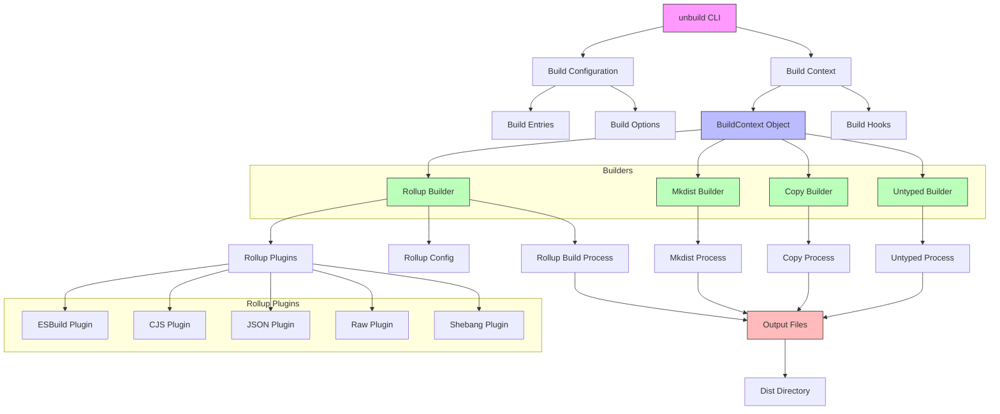

# unbuild 项目架构图

这个架构图展示了unbuild项目的主要组件和它们之间的关系：

1. **入口点**: unbuild CLI是整个构建系统的入口点
2. **配置层**: Build Configuration定义了构建条目和选项
3. **上下文层**: Build Context包含构建过程中的上下文信息
4. **构建器层**:
   - Rollup Builder: 主要的打包构建器
   - Mkdist Builder: 用于文件到文件的转译
   - Copy Builder: 用于复制文件
   - Untyped Builder: 用于类型生成
5. **插件层**: Rollup构建器使用的各种插件
6. **输出层**: 所有构建器的输出最终都汇聚到Dist目录
