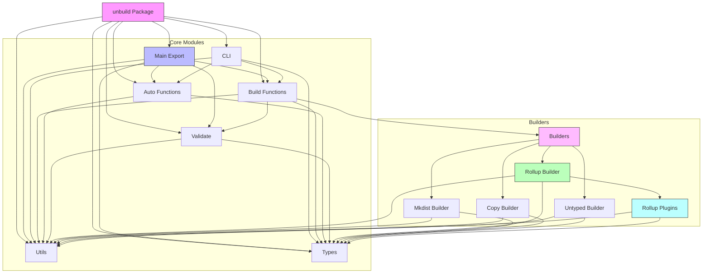

# unbuild 组件关系图

这个组件关系图展示了unbuild包中各个模块之间的依赖关系：

1. **核心模块**:
   - Main Export: 主要导出模块，聚合了其他核心功能
   - CLI: 命令行接口模块
   - Build Functions: 核心构建函数
   - Auto Functions: 自动配置相关函数
   - Utils: 工具函数
   - Types: 类型定义
   - Validate: 验证函数

2. **构建器模块**:
   - Rollup Builder: Rollup构建器
   - Mkdist Builder: Mkdist构建器
   - Copy Builder: 复制构建器
   - Untyped Builder: Untyped构建器
   - Rollup Plugins: Rollup插件集合

所有模块都依赖于Utils和Types模块，这体现了良好的架构设计，将通用功能和类型定义分离出来供所有模块使用。
