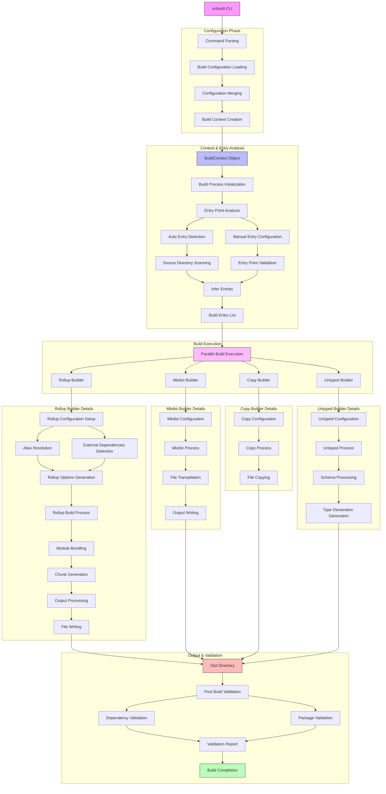

# unbuild 详细架构图

这个详细的架构图展示了unbuild项目的完整构建流程：

1. **配置阶段**:
   - 命令解析
   - 构建配置加载
   - 配置合并

2. **上下文和入口点分析**:
   - 构建上下文创建
   - 入口点分析（自动检测或手动配置）
   - 源目录扫描和入口推断

3. **构建执行**:
   - 并行构建执行
   - Rollup构建器
   - Mkdist构建器
   - Copy构建器
   - Untyped构建器

4. **Rollup构建器详细流程**:
   - Rollup配置设置
   - 别名解析和外部依赖检测
   - Rollup选项生成
   - 模块打包和块生成
   - 输出处理和文件写入

5. **其他构建器流程**:
   - Mkdist: 文件转译和输出写入
   - Copy: 文件复制
   - Untyped: 模式处理和类型声明生成

6. **输出和验证**:
   - 所有构建器输出到Dist目录
   - 构建后验证（依赖验证和包验证）
   - 构建完成
